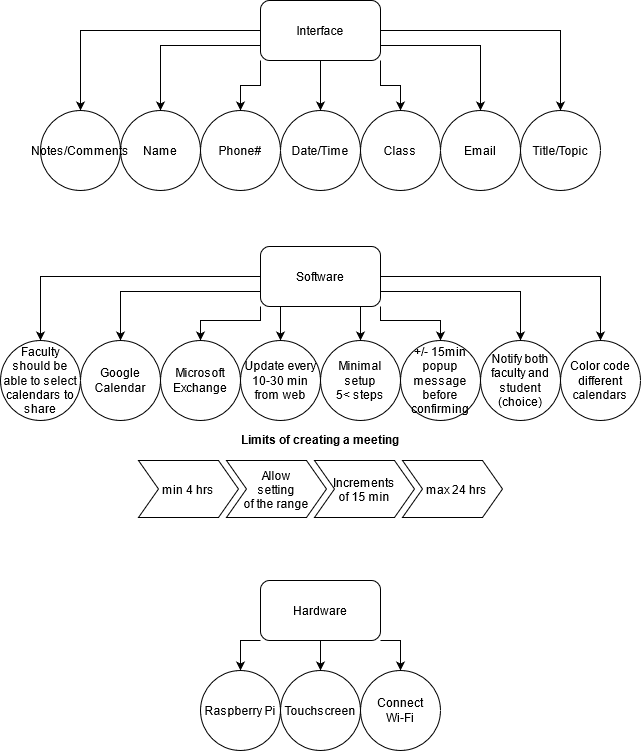

# SoftwareDevCS483
This project is a meeting scheduler using google calender api and microsoft exchange.

### Given Figures
 
*The left side of the picture is the mount point for the device*
 
*Suggested form layout from the client*
 
*Current and provided hardware from the client*

### Break down of the project

*This break down should help us divide the work load among our group*
