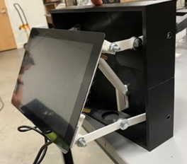

# SoftwareDevCS483
This project is a meeting scheduler using google calender api and microsoft exchange.

### Given Figures
 
*The right side of the picture is the mount point for the device* 
 
*Suggested form layout from the client* 
 
*Current and provided hardware from the client* 

### Rough Layout of the project
 

[Home](wiki/Home)
*This break down should help us divide the work load among our group* 

### Console Application
**QuickStartCMD.zip
* Go here to setup your creds here: https://console.cloud.google.com/apis/dashboard
* The guide for the setup is here: https://developers.google.com/calendar/api/quickstart/js

### Rough how-to on: enabling the google's api and creating credentials

### Rough how-to on: using the credentials to get your google's calendar events

